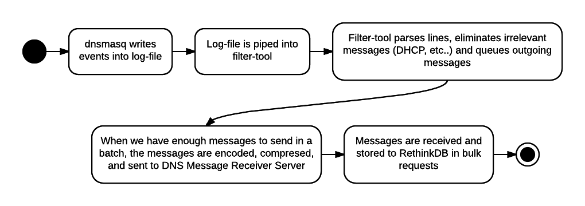
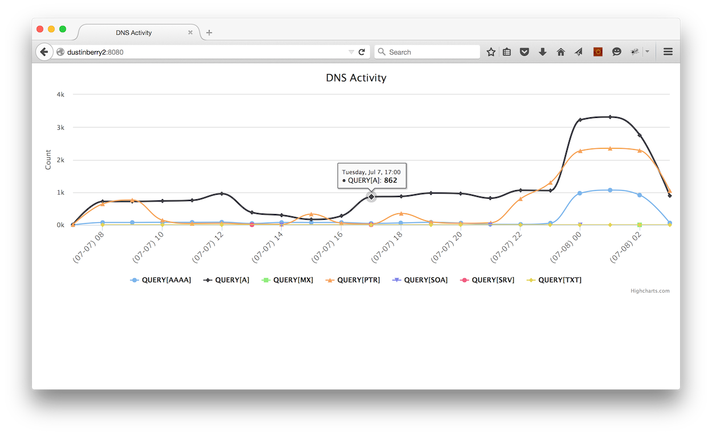

## Overview

The purpose of this project was to configure a RPi device to resemble a hardware DNS server that emits resolution activity. In this case, I coerced my home network to write DNS resolution events to a log, use a tool ("filter tool") to parse and transmit them, and a DNS message-receiver server to persist and present activity. 



Since the filter-tool sends the batched messages to a URL endpoint, the DNS server and the message-receiver server are decoupled and need not be colocated.


## Process

1. Install and configure *dnsmasq* for your DNS entries as well as to write events to log-file.
2. Install RethinkDB so that we can persist the events.
3. Install the DNS message-receiver server.
4. Provision the DB (*dmr_db_provision*).
4. Start the server (*dmr_server_prod*).
5. Download the filter-tool script (*dnsmasq_filter*) to the host and pipe the output of "tail -f <log-file>" into it. 

   Note that, because we're auditing the log-file and not actually part of the resolution process, the DNS server will still be operating at peak efficiency.

6. Either use the console to print recent activity (*dmr_db_model_dns_message_print_by_hour*):

    ```
    dustin@dustinberry2:~$ dmr_db_model_dns_message_print_by_hour 
    [(2015, 7, 7, 4)] [query[AAAA]]: (66)
    [(2015, 7, 7, 4)] [query[A]]: (644)
    [(2015, 7, 7, 4)] [query[PTR]]: (582)
    [(2015, 7, 7, 4)] [query[TXT]]: (1)
    [(2015, 7, 7, 5)] [query[AAAA]]: (75)
    [(2015, 7, 7, 5)] [query[A]]: (720)
    [(2015, 7, 7, 5)] [query[PTR]]: (765)
    [(2015, 7, 7, 6)] [query[AAAA]]: (80)
    [(2015, 7, 7, 6)] [query[A]]: (735)
    [(2015, 7, 7, 6)] [query[PTR]]: (146)
    [(2015, 7, 7, 6)] [query[TXT]]: (2)
    ...
    ```

...or the webpage (e.g. http://localhost:81) to show a chart. Note that the webpage produces an interactive graph, where you can toggle the different types of events:




## Interpretation of Data Shape

Obviously, the "QUERY[A]" (IPv4 domain lookups) events are the highest with the MX lookups (mail-domain lookups) being the lowest. 

Notice that there's a drop between 12p and 5p, where I was both involved in professional work and dealing with a pair of power-outages. Resolution was at a minimum. Conversely, notice the strong rise between 11p and 3a, where I happened to be feverishly trying to debug the charting library ([Highcharts](http://www.highcharts.com)) as well as the database backend ([RethinkDB](http://www.rethinkdb.com)). I was doing much searching and visiting many different domains (where repeated, uncached resolutions were required).


## Notes

Unfortunately, due to the 1) external dependencies, 2) STDIN/STDOUT console piping architecture, and 3) server nature of the realization of this assignment, it wasn't possible/practical to use IPython for documentation. None of the components would've been executable. However, all documentation has been written in Markdown.


## Component Links

- [dnsmasq_filter](dnsmasq_filter/INSTALL.md): Filter tool installation steps
- [dns_messages_receiver](dns_messages_receiver/dmr/resources/INSTALL.md): Server installation steps
