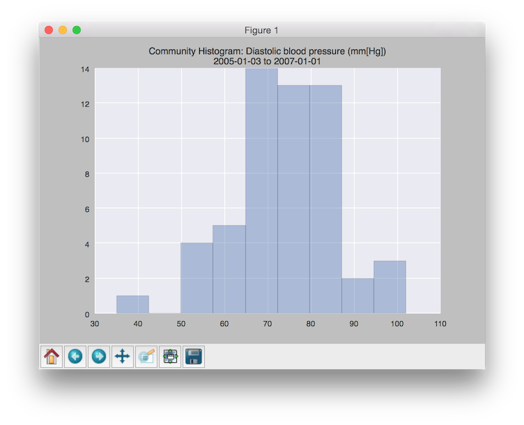
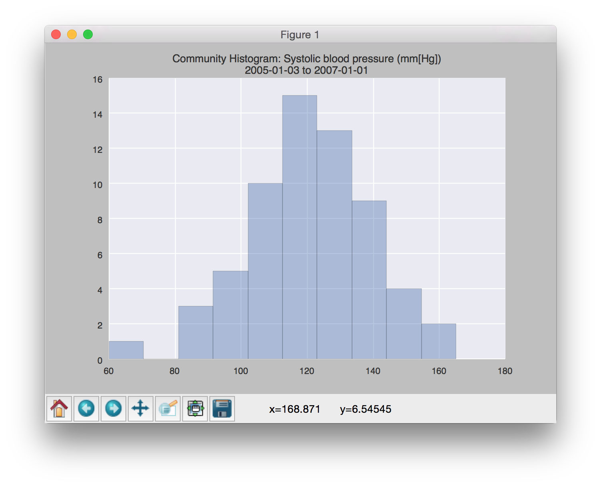

## Introduction

This assignment is a treatment of option (1): To visualize the combined health metrics for all members of the community during a given time period. This is represented as a histogram.

## Requirements

Install the dependencies by running the following:

```
$ sudo pip install -r requirements.txt
```

## Process Overview

1. Read the list of patients from the public [SMART on FIHR sandbox server](http://docs.smarthealthit.org/sandbox).
2. For each patient, read all available vitality information using the "observation" resource-type.
3. We bin the data for all vital-signs. We also filter by timestamp at this point rather than in the initial SMART/FIHR query due to lack of documentation.
4. We also store a catalog of the types of vital-signs and their descriptions as they are encountered.
5. In a second-pass, we render a plot for each vital-sign that we received a minimum number of records for (currently 50). This currently disqualifies everything but the diastolic and systolic blood-pressure readings. All other data is too trivial (even without a date-range filter).
6. We display the type of vital-sign in the title of the plot, as well as the unit of the measurement.


## Features

- We will display graphs for every type of vital sign that we've received a minimum amount of data for.
- The title of the output graph will indicate the actual date-range and unit of the data found.
- The [Seaborn](http://stanford.edu/~mwaskom/software/seaborn) graph library is used to draw the plots, as in previous assignments. Seaborn provides very attractive representations.
- The patient data as well as the vital signs are cached locally, by default. Subsequent executions will run instantaneously.


## Screenshots

Community *diastolic* blood-pressure:



Community *systolic* blood-pressure:


